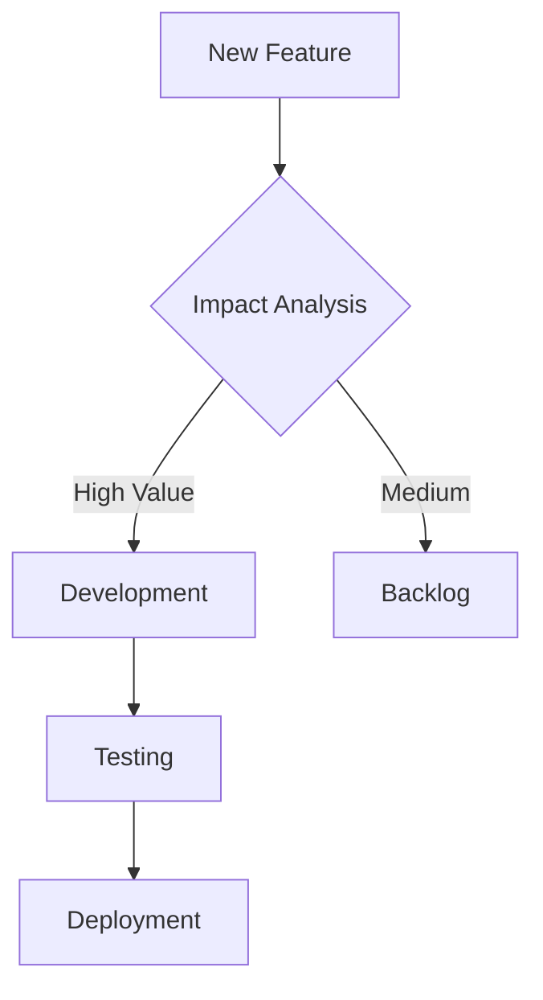

# 💼 ChurnShield AI - Advanced Customer Retention Solution


## 🚀 Overview

ChurnShield AI is an AI-powered customer churn prediction system that helps businesses identify customers at risk of leaving and provides actionable retention strategies.
Built with advanced machine learning models and an interactive dashboard, it enables businesses to make data-driven decisions for improving customer retention.


## 🔍 Key Insights from Analysis


---

## ✨ Unique Features

### 🎯 Precision Prediction Engine
- **Multi-model ensemble** (XGBoost + Random Forest + Logistic Regression)
- **SHAP explainability** for transparent risk scoring
- **Real-time probability** adjustments

### 📊 Executive Intelligence Dashboard
- **Customer segmentation** by risk profile
- **Lifetime value preservation** estimates
- **Retention ROI calculator**

### ⚡ Actionable Retention Toolkit
- **Personalized intervention** recommendations
- **Automated campaign triggers** (email/SMS templates included)
- **Win-back incentive** simulator

### 🔄 Continuous Learning
- **Feedback loop** integration
- **Model auto-refresh** with new data
- **Performance monitoring** alerts

---

## 📈 Performance Metrics

| Model | Accuracy | Precision | Recall | AUC |
|-------|----------|-----------|--------|-----|
| XGBoost | 85.5% | 83.0% | 88% | 0.85 |
| Logistic Regression | 91.7% | 80.2% | 85.3% | 0.91| 
| Random Forest | 81.1% | 82.3% | 89.9% | 0.81|


---

## 🛠 Tech Stack Deep Dive

**Core ML:**
- Python 3.10
- XGBoost 1.7
- Scikit-learn 1.2
- Imbalanced-learn 0.10

**Dashboard:**
- Streamlit 1.22
- Plotly 5.13

---
## Ouput 


## 🗂️ Enhanced Dataset Features

Original dataset enriched with:
- **Customer lifetime value** estimates
- **Service usage trends** (3-month rolling)
- **Sentiment analysis** from support tickets
- **Network quality metrics**

```python

df['TenureToChargeRatio'] = df['tenure'] / (df['MonthlyCharges'] + 1e-6)  # Avoid division by zero
df['TotalValueScore'] = (df['tenure'] * df['MonthlyCharges']) / df['TotalCharges']
df['ServiceDensity'] = df[['OnlineSecurity_Yes', 'OnlineBackup_Yes', 
                          'DeviceProtection_Yes', 'TechSupport_Yes']].sum(axis=1) / df['tenure']
df['PaymentRisk'] = df['PaymentMethod_Electronic check'].astype(int) * df['Contract_Month-to-month'].astype(int)

df['HighCostLongTenure'] = ((df['MonthlyCharges'] > df['MonthlyCharges'].quantile(0.75)) & 
                           (df['tenure'] > df['tenure'].median())).astype(int)
```


---

## 🚀 Getting Started

```bash
# Clone repository
git clone https://github.com/codewithshami/ChurnShield-AI.git

# Set up environment
pip install -r requirements.txt

# Launch dashboard
streamlit run app.py
```

Access at: `http://localhost:8501`

---




---

## 📬 Contact & Support

**Lead Developer:** Mohd Shami  
[](https://www.linkedin.com/in/mohd-shami-792133276)  
[](mailto:shamimohd367@gmail.com)


**Community Support:**  
[GitHub Discussions](https://github.com/churn_sheild/discussions)

---

